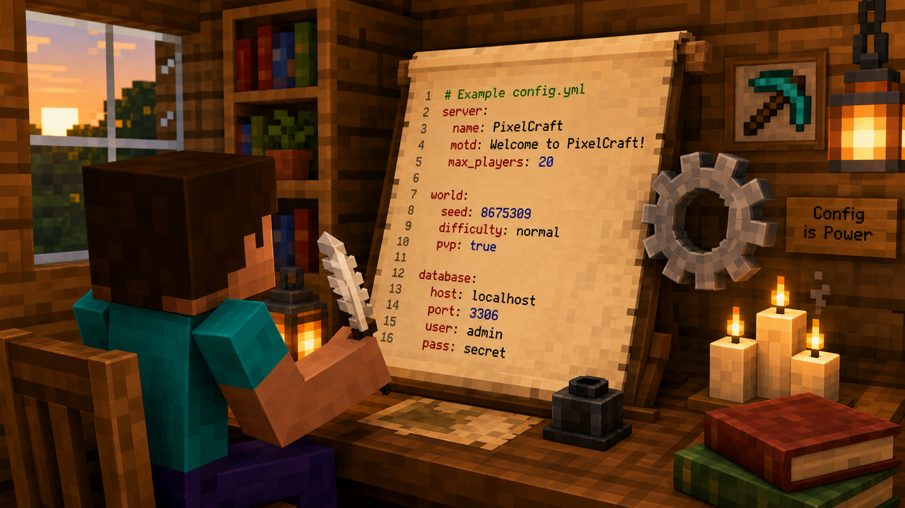

# Configuration



TownyElections stores its settings in `plugins/TownyElections/config.yml`. This page documents every option, what it does, and sensible defaults.

After editing the config, run `/telection reload` or restart your server for changes to take effect.


If a setting is missing from your config file (for example, after updating the plugin), TownyElections will fall back to its built-in default value and log a notification in the console.


## Core Settings

### `enabled`

```yaml
enabled: true
```

Master toggle for the plugin. Set to `false` to disable all election functionality without removing the plugin.

### `language`

```yaml
language: "en"
```

The language file to use for player messages and GUI text. Language files are stored in `plugins/TownyElections/lang/`. The default is English (`en`).

## Election Timing

These settings control when elections are scheduled and how long they run.

### `mayor-elections`

```yaml
mayor-elections:
  enabled: true
  interval-days: 30
  duration-minutes: 1440
  candidacy-duration-minutes: 720
  cooldown-after-leave-days: 3
```

| Option | Description | Default |
|---|---|---|
| `enabled` | Whether mayor elections are active. | `true` |
| `interval-days` | How often (in real-world days) recurring mayor elections automatically start. Set to `0` to disable automatic scheduling. | `30` |
| `duration-minutes` | How long the voting phase lasts, in minutes. | `1440` (24 hours) |
| `candidacy-duration-minutes` | How long players can declare candidacy before voting begins. | `720` (12 hours) |
| `cooldown-after-leave-days` | Number of days a player must wait after leaving a town before they can run or vote in that town's election. | `3` |

### `nation-elections`

```yaml
nation-elections:
  enabled: true
  interval-days: 60
  duration-minutes: 2880
  candidacy-duration-minutes: 1440
  cooldown-after-leave-days: 7
```

Same structure as mayor elections, but for nation leader races. Defaults are scaled to be less frequent since nation leadership changes are typically less common.

## Eligibility

Control who is allowed to run as a candidate and who is allowed to vote.

### `candidate-requirements`

```yaml
candidate-requirements:
  min-playtime-hours: 24
  min-residency-days: 7
  require-full-resident: true
  banned-ranks: []
  fee:
    enabled: false
    amount: 500.0
    refund-on-loss: false
```

| Option | Description | Default |
|---|---|---|
| `min-playtime-hours` | Minimum total playtime (in hours) a player must have on the server before they can run for office. | `24` |
| `min-residency-days` | Minimum number of days a player must have been a resident of the town (or member of the nation) before running. | `7` |
| `require-full-resident` | If `true`, only players with the default `resident` rank (and not just plot-adding/outsider status) can run. | `true` |
| `banned-ranks` | A list of permission groups or Towny ranks that are not allowed to run (e.g., staff ranks if you want staff neutrality). | `[]` |
| `fee.enabled` | Whether candidates must pay an entry fee to run. | `false` |
| `fee.amount` | The amount of currency required to declare candidacy (requires Vault + economy). | `500.0` |
| `fee.refund-on-loss` | Whether to refund the candidacy fee to candidates who do not win. | `false` |

### `voter-requirements`

```yaml
voter-requirements:
  min-playtime-hours: 1
  min-residency-days: 1
  one-vote-per-ip: false
  require-not-absent: true
```

| Option | Description | Default |
|---|---|---|
| `min-playtime-hours` | Minimum playtime hours required to cast a vote. Prevents brand-new alt accounts from swinging elections. | `1` |
| `min-residency-days` | Minimum days a player must have been in the town/nation before they can vote. | `1` |
| `one-vote-per-ip` | If `true`, only one vote is counted per IP address in each election. Useful to deter alt voting, but use carefully on shared networks. | `false` |
| `require-not-absent` | If `true`, players marked as absent/inactive by Towny will not be able to vote. | `true` |

## Voting Rules

### `voting-system`

```yaml
voting-system:
  type: "plurality"
  allow-abstain: true
  rank-counting: "instant-runoff"
  tiebreaker: "random"
```

| Option | Description | Options |
|---|---|---|
| `type` | The voting method to use. | `plurality`, `runoff`, `instant-runoff`, `ranked-pairs` |
| `allow-abstain` | If `true`, voters can submit a blank/abstain ballot. Abstentions are counted but do not affect the winner. | `true`/`false` |
| `rank-counting` | How ranked votes are counted when `type` is set to a ranked system. | `instant-runoff`, `bordacount`, `ranked-pairs` |
| `tiebreaker` | What happens when two or more candidates tie for the win. | `random`, `seniority`, `admin-decision` |

**Voting types:**

* **`plurality`** (first-past-the-post) — Voters pick one candidate; whoever gets the most votes wins. Simple and common.
* **`runoff`** — If no candidate reaches a majority (>50%), the top two candidates proceed to a second round.
* **`instant-runoff`** (IRV) — Voters rank candidates; lowest-ranked candidates are eliminated and their votes redistributed until someone reaches a majority.
* **`ranked-pairs`** (Condorcet method) — Voters rank candidates; the system compares every pair and picks the candidate who would win against every other candidate head-to-head.

### `ballot-secrecy`

```yaml
ballot-secrecy:
  public-votes: false
  announce-winner-immediately: true
  show-vote-counts-live: false
```

| Option | Description |
|---|---|
| `public-votes` | If `true`, everyone can see who each player voted for. If `false`, votes are anonymous until results are tallied. |
| `announce-winner-immediately` | If `true`, the winner is announced in chat the moment the election ends. |
| `show-vote-counts-live` | If `true`, current vote tallies are visible to everyone during the election. If `false`, tallies are only shown when the election ends. |


Enabling `show-vote-counts-live` can encourage strategic voting and bandwagon effects. Many servers leave this off so voters make up their own minds.


## Political Parties

```yaml
parties:
  enabled: false
  min-members-to-create: 2
  max-candidates-per-party: 1
  party-colors: true
```

| Option | Description | Default |
|---|---|---|
| `enabled` | Toggle political party support on or off. | `false` |
| `min-members-to-create` | Minimum number of founding members required to register a party. | `2` |
| `max-candidates-per-party` | How many candidates from the same party can run in a single election. Set to `1` to enforce one-candidate-per-party tickets. | `1` |
| `party-colors` | If `true`, party names are colored in chat and in GUIs using the party's chosen color. | `true` |

## Notifications

```yaml
notifications:
  announce-election-start: true
  announce-candidacy-open: true
  announce-voting-open: true
  announce-election-end: true
  remind-voters:
    enabled: true
    interval-minutes: 360
  actionbar:
    enabled: true
    show-time-remaining: true
```

| Option | Description |
|---|---|
| `announce-election-start` | Broadcast when an election is scheduled/started. |
| `announce-candidacy-open` | Broadcast when the candidacy phase opens. |
| `announce-voting-open` | Broadcast when voting begins. |
| `announce-election-end` | Broadcast the winner when the election ends. |
| `remind-voters.enabled` | Send periodic reminders to eligible voters who haven't voted yet. |
| `remind-voters.interval-minutes` | How often (in minutes) to send reminder messages to non-voters. |
| `actionbar.enabled` | Show election reminders in the action bar while an election is running. |
| `actionbar.show-time-remaining` | Display how much time is left in the election in the action bar. |

## Integration

### Economy

```yaml
economy:
  enabled: false
  currency-symbol: "$"
  candidacy-fee: 100.0
  vote-bonus:
    enabled: false
    amount: 10.0
```

| Option | Description |
|---|---|
| `enabled` | Master toggle for all economy features. Requires Vault and an economy plugin. |
| `currency-symbol` | The symbol used when displaying prices (e.g., `$`, `€`, `coins`). |
| `candidacy-fee` | Default fee to run for office (can be overridden per-election type in `candidate-requirements.fee.amount`). |
| `vote-bonus.enabled` | Reward players with money when they vote. Encourages turnout. |
| `vote-bonus.amount` | Amount paid to a player for casting a vote. |

### Discord (if supported)

```yaml
discord:
  enabled: false
  webhook-url: ""
  announce-start: true
  announce-results: true
```

If your version of TownyElections supports Discord integration, these settings control webhook notifications for a linked Discord server.

## Data & Storage

```yaml
storage:
  type: "sqlite"
  mysql:
    host: "localhost"
    port: 3306
    database: "townyelections"
    username: "root"
    password: ""
    prefix: "te_"
  keep-results-days: 365
```

| Option | Description |
|---|---|
| `type` | Storage backend. Use `sqlite` for single-server setups or `mysql` for networks. |
| `mysql.*` | MySQL connection settings (only used when `type` is `mysql`). |
| `keep-results-days` | How many days to keep past election results in the database. Set to `-1` to keep indefinitely. |

## Default Configuration Template

For reference, the full default config looks roughly like this:

```yaml
enabled: true
language: "en"

mayor-elections:
  enabled: true
  interval-days: 30
  duration-minutes: 1440
  candidacy-duration-minutes: 720
  cooldown-after-leave-days: 3

nation-elections:
  enabled: true
  interval-days: 60
  duration-minutes: 2880
  candidacy-duration-minutes: 1440
  cooldown-after-leave-days: 7

candidate-requirements:
  min-playtime-hours: 24
  min-residency-days: 7
  require-full-resident: true
  banned-ranks: []
  fee:
    enabled: false
    amount: 500.0
    refund-on-loss: false

voter-requirements:
  min-playtime-hours: 1
  min-residency-days: 1
  one-vote-per-ip: false
  require-not-absent: true

voting-system:
  type: "plurality"
  allow-abstain: true
  rank-counting: "instant-runoff"
  tiebreaker: "random"

ballot-secrecy:
  public-votes: false
  announce-winner-immediately: true
  show-vote-counts-live: false

parties:
  enabled: false
  min-members-to-create: 2
  max-candidates-per-party: 1
  party-colors: true

notifications:
  announce-election-start: true
  announce-candidacy-open: true
  announce-voting-open: true
  announce-election-end: true
  remind-voters:
    enabled: true
    interval-minutes: 360
  actionbar:
    enabled: true
    show-time-remaining: true

economy:
  enabled: false
  currency-symbol: "$"
  candidacy-fee: 100.0
  vote-bonus:
    enabled: false
    amount: 10.0

discord:
  enabled: false
  webhook-url: ""
  announce-start: true
  announce-results: true

storage:
  type: "sqlite"
  mysql:
    host: "localhost"
    port: 3306
    database: "townyelections"
    username: "root"
    password: ""
    prefix: "te_"
  keep-results-days: 365
```
