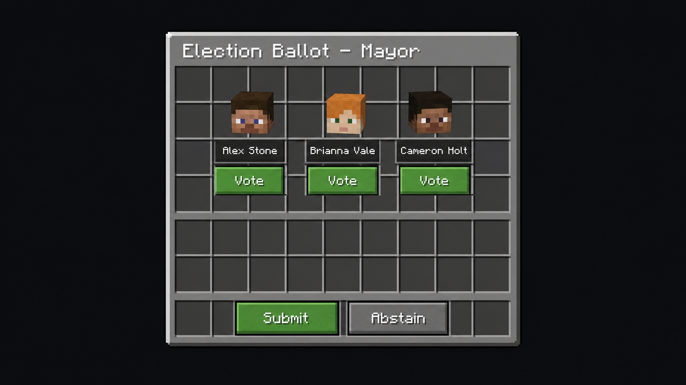

# Voting

This page explains the election lifecycle from the player perspective — how to run for office, how to vote, and what happens when an election concludes.

## The Election Lifecycle

Every election in TownyElections moves through a predictable series of phases. Understanding these phases helps candidates plan their campaigns and ensures voters don't miss their chance to participate.

### 1. Scheduled

When a new election is scheduled (either automatically based on the configured interval or manually by an admin), the server announces that an election is coming up. No one can declare candidacy yet during this phase, but players can start campaigning.

### 2. Candidacy Phase

The candidacy phase opens before voting begins. During this window, eligible players can declare themselves as candidates.

To declare your candidacy:

```
/election run
```

You will be prompted with confirmation if there is a candidacy fee, and your name will appear on the candidate list.

To withdraw from the race:

```
/election withdraw
```


You cannot withdraw after the voting phase begins unless an admin manually removes you from the ballot.


To see who is running:

```
/election candidates
```

### 3. Voting Phase

When the candidacy phase closes, voting opens. All eligible voters receive a notification (in chat and optionally via action bar reminders) that the ballot is open.

### 4. Results Phase

When the voting window closes, the plugin tallies the votes and announces the winner. The winner is immediately sworn in as Mayor or Nation Leader.

## How to Vote

When an election is active in your town or nation, open the ballot with:

```
/vote
```

This opens the voting GUI, where you will see:

* The position being elected (Mayor or Nation Leader).
* The time remaining in the election.
* A list of candidates with their party affiliation (if parties are enabled).



### Plurality Voting

If the server uses **plurality** (first-past-the-post), simply click the candidate you want to vote for. You will be asked to confirm your vote. Once confirmed, your vote is locked in and cannot be changed.

### Ranked Voting

If the server uses a **ranked** system (instant runoff or ranked pairs), you can rank candidates in order of preference by clicking them in sequence:

1. Click your first-choice candidate (marked as #1).
2. Click your second-choice candidate (marked as #2).
3. Continue until you have ranked as many candidates as you wish to rank.
4. Click **Submit Ballot** to cast your vote.

You do not have to rank every candidate — ranking fewer is allowed, and candidates you leave unranked will not receive your vote if all your higher choices are eliminated.

### Abstaining

If `allow-abstain` is enabled in the config, you can choose "Abstain" on the ballot. An abstention records that you participated but does not support any candidate. Abstentions are counted in turnout statistics but do not change the vote totals.

### Changing Your Vote

Depending on server configuration, you may or may not be able to change your vote after submitting:

* If vote changes are allowed, simply run `/vote` again and re-submit a new ballot before the election closes.
* If vote changes are disabled (the typical setup), your first submission is final.

## Campaign Tips for Candidates


Running a successful campaign in TownyElections is largely about being active and engaged with your town or nation members. Some suggestions:

* **Announce your platform early.** Let people know what you plan to do as Mayor or Nation Leader — more plots, lower taxes, new infrastructure, etc.
* **Be present during the candidacy phase.** Players are more likely to vote for candidates who answer questions and participate in community chat.
* **Join or form a party (if enabled).** Parties help you organize with like-minded players and appear as a unified ticket.
* **Don't wait until the last minute.** Declare your candidacy as soon as the phase opens so you have the maximum amount of time to campaign.
* **Respect the rules.** Attempting to bribe voters with real items or currency outside the plugin's economy features, or using alt accounts to vote, is typically against server rules and can result in disqualification by admins.

## Viewing Election Information

You can check on elections at any time using a few useful commands:

| Command | What it does |
|---|---|
| `/election info` | Shows all current and upcoming elections relevant to you. |
| `/election candidates` | Lists all candidates in the current election you're eligible to vote in. |
| `/election results` | After an election ends, shows the final vote tallies. |
| `/election results [town/nation] [name]` | View results for a specific town or nation (if you have permission). |

## After the Election

When voting closes and a winner is declared:


1. The winner is announced publicly in chat.
2. The winner is automatically promoted to Mayor (if it was a town election) or Nation Leader (if it was a nation election) through Towny.
3. The previous leader is demoted to a regular resident/member rank (they are not removed from the town/nation unless other plugins handle that).
4. The election results are saved and can be viewed later with `/election results`.

### What if there's a tie?

The tiebreaker rule set in the config determines the outcome:

* **`random`** — One of the tied candidates is chosen at random.
* **`seniority`** — The candidate who has been a resident/member the longest wins.
* **`bye`** — The incumbent retains their position if they are one of the tied candidates.
* **`admin-decision`** — Staff must resolve the tie manually.

### What if nobody runs?

If no candidates declare during the candidacy phase, the election is typically declared uncontested. What happens next depends on configuration, but common behaviors are:

* The incumbent remains in office until the next election cycle.
* Staff are notified and can appoint someone manually.
* The election is re-opened for an extended candidacy window.

Check with your server admin to see how uncontested elections are handled on your specific server.

## Common Questions

**Can I vote in multiple elections at once?**
Yes. If you are a member of both a town and a nation and both have elections running simultaneously, you can vote in each race separately.

**Can I vote from anywhere?**
By default, yes — you don't need to be physically in your town or nation capital to vote. However, some servers may configure proximity requirements through other plugins.

**Do I lose my stuff if I lose an election?**
No. Losing an election simply means you don't become (or remain) leader. Your inventory, claims, and resident status are unaffected.

**Can the winner be removed?**
Yes. Server admins always retain the ability to appoint or remove leaders through Towny commands, just as they could before TownyElections was installed. Additionally, a new election will be held at the end of the current term.

**What if I'm offline when the election happens?**
If you are offline for the entire voting period you will miss your chance to vote. Consider asking a server admin if reminder messages or longer voting windows can help you participate in future elections.
